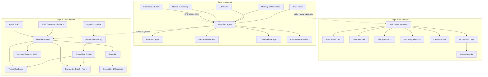

# AI Engineer — Complete Implementation Plan

> **Goal**: Build a production-grade AI engineering platform across three interconnected repositories, covering every concept in the GenAI & Agentic AI workflow — from foundational RAG to multi-agent orchestration with MCP tool integration.

---

## System Architecture Overview



---

## Technology Stack

| Layer | Technology | Purpose |
|:---|:---|:---|
| **Language** | Python 3.12+ | All three repos |
| **Package Manager** | `uv` | Fast, modern dependency management |
| **Agent Orchestration** | LangGraph | Stateful graph-based multi-agent workflows |
| **LLM Framework** | LangChain | Chains, prompts, LLM integrations |
| **MCP SDK** | `mcp` (FastMCP) | Model Context Protocol server/client |
| **MCP Adapters** | `langchain-mcp-adapters` | Bridge MCP tools into LangGraph |
| **A2A Protocol** | `a2a` | Agent-to-Agent communication |
| **LLM Providers** | OpenAI, Groq, Google Gemini, Ollama | Multi-provider LLM support |
| **Vector Databases** | FAISS, Qdrant, ChromaDB | Semantic search |
| **Knowledge Graph** | Neo4j + `neo4j-graphrag` | GraphRAG, entity relationships |
| **Embeddings** | `sentence-transformers`, OpenAI | Dense vector embeddings |
| **Keyword Search** | BM25 (rank-bm25) | Lexical retrieval |
| **Reranking** | `sentence-transformers` Cross-Encoder | Result re-ordering |
| **Evaluation** | RAGAS, Langfuse | RAG quality metrics |
| **Backend API** | FastAPI | REST API for MCP backend |
| **Database** | PostgreSQL, SQLite | State persistence, checkpoints |
| **Observability** | LangSmith, Langfuse | Tracing, debugging |
| **Testing** | pytest, MCP Inspector | Unit + integration tests |

---

## Proposed Changes

### Repo 1: AiAgents

> The brain of the system — multi-agent orchestration with LangGraph, MCP client for tool access, A2A for inter-agent communication, memory, guardrails, and human-in-the-loop workflows.

---

#### Directory Structure

```
AiEngineer/
└── AiAgents/
    ├── pyproject.toml
    ├── README.md
    ├── .env.example
    ├── .gitignore
    │
    ├── src/
    │   ├── __init__.py
    │   │
    │   ├── config/
    │   │   ├── __init__.py
    │   │   ├── settings.py              # Pydantic Settings (env vars, model configs)
    │   │   └── llm_providers.py         # Multi-provider LLM factory (OpenAI, Groq, Gemini, Ollama)
    │   │
    │   ├── models/
    │   │   ├── __init__.py
    │   │   ├── state.py                 # TypedDict/Pydantic state schemas for all agent graphs
    │   │   └── schemas.py               # Shared Pydantic models (AgentMessage, TaskResult, etc.)
    │   │
    │   ├── agents/
    │   │   ├── __init__.py
    │   │   ├── base_agent.py            # Abstract base agent class
    │   │   ├── supervisor/
    │   │   │   ├── __init__.py
    │   │   │   ├── supervisor_agent.py  # Central orchestrator (Supervisor pattern)
    │   │   │   └── router.py            # Conditional routing logic
    │   │   ├── research/
    │   │   │   ├── __init__.py
    │   │   │   └── research_agent.py    # Web search, summarization, fact-checking
    │   │   ├── data_analysis/
    │   │   │   ├── __init__.py
    │   │   │   └── data_agent.py        # Data extraction, analysis, visualization prompts
    │   │   ├── conversational/
    │   │   │   ├── __init__.py
    │   │   │   └── chat_agent.py        # General conversational agent with memory
    │   │   └── rag_agent/
    │   │       ├── __init__.py
    │   │       └── rag_agent.py         # Agent that interfaces with GenAISystem for retrieval
    │   │
    │   ├── graphs/
    │   │   ├── __init__.py
    │   │   ├── single_agent_graph.py    # Simple ReAct agent graph
    │   │   ├── multi_agent_graph.py     # Supervisor-Worker multi-agent graph
    │   │   ├── hierarchical_graph.py    # Hierarchical multi-agent (teams of teams)
    │   │   ├── plan_execute_graph.py    # Planner-Executor pattern
    │   │   └── map_reduce_graph.py      # Map-Reduce parallel processing pattern
    │   │
    │   ├── mcp_client/
    │   │   ├── __init__.py
    │   │   ├── client.py                # MultiServerMCPClient wrapper
    │   │   ├── config.py                # MCP server connection configs (stdio, streamable-http)
    │   │   └── tool_adapter.py          # Adapt MCP tools to LangGraph ToolNodes
    │   │
    │   ├── a2a/
    │   │   ├── __init__.py
    │   │   ├── a2a_client.py            # A2A client for discovering & calling remote agents
    │   │   ├── a2a_server.py            # A2A server to expose agents for external consumption
    │   │   └── agent_card.py            # Agent Card definitions (capabilities, skills)
    │   │
    │   ├── memory/
    │   │   ├── __init__.py
    │   │   ├── checkpointer.py          # LangGraph checkpointer (SQLite/PostgreSQL)
    │   │   ├── conversation_memory.py   # ConversationBufferMemory, ConversationSummaryMemory
    │   │   └── long_term_memory.py      # Vector-backed long-term memory store
    │   │
    │   ├── prompts/
    │   │   ├── __init__.py
    │   │   ├── prompt_templates.py      # Reusable prompt templates (system, user, few-shot)
    │   │   ├── few_shot.py              # Few-shot example management
    │   │   ├── chain_of_thought.py      # CoT, Self-Consistency, Tree-of-Thought wrappers
    │   │   └── structured_output.py     # Structured output enforcement (JSON mode, Pydantic)
    │   │
    │   ├── guardrails/
    │   │   ├── __init__.py
    │   │   ├── input_validator.py       # Pre-LLM input validation (PII, injection detection)
    │   │   ├── output_validator.py      # Post-LLM output validation (hallucination, toxicity)
    │   │   ├── action_validator.py      # Tool/action approval guardrails
    │   │   └── safety_config.py         # Safety rules, blacklists, thresholds
    │   │
    │   ├── human_in_loop/
    │   │   ├── __init__.py
    │   │   ├── interrupt_handler.py     # LangGraph interrupt points for human review
    │   │   └── approval_workflow.py     # Approval/rejection/modification logic
    │   │
    │   └── utils/
    │       ├── __init__.py
    │       ├── logger.py                # Structured logging
    │       └── tracing.py              # LangSmith/Langfuse integration
    │
    ├── examples/
    │   ├── 01_single_react_agent.py     # Basic ReAct agent with tools
    │   ├── 02_multi_agent_supervisor.py # Supervisor orchestrating specialists
    │   ├── 03_human_in_loop.py          # Agent with human approval gates
    │   ├── 04_mcp_client_agent.py       # Agent using MCP tools
    │   ├── 05_a2a_communication.py      # Agent-to-Agent delegation
    │   ├── 06_rag_agent.py              # Agent querying GenAISystem
    │   ├── 07_plan_and_execute.py       # Planner-Executor pattern
    │   └── 08_guardrails_demo.py        # Safety and validation demo
    │
    └── tests/
        ├── __init__.py
        ├── test_agents.py
        ├── test_graphs.py
        ├── test_mcp_client.py
        ├── test_guardrails.py
        └── test_memory.py
```

---

#### Phase 1: Foundation & Configuration

##### [NEW] [pyproject.toml](file:///Users/aashu-kumar-jha/Documents/projects/AiEngineer/AiAgents/pyproject.toml)
- Project metadata, dependencies: `langgraph`, `langchain`, `langchain-openai`, `langchain-groq`, `langchain-google-genai`, `langchain-mcp-adapters`, `mcp`, `a2a`, `pydantic-settings`, `python-dotenv`
- Dev dependencies: `pytest`, `pytest-asyncio`, `ruff`

##### [NEW] [settings.py](file:///Users/aashu-kumar-jha/Documents/projects/AiEngineer/AiAgents/src/config/settings.py)
- Pydantic `BaseSettings` for centralized configuration
- Environment-based config: `OPENAI_API_KEY`, `GROQ_API_KEY`, `GOOGLE_API_KEY`, `LANGSMITH_API_KEY`
- Model selection, temperature defaults, max tokens

##### [NEW] [llm_providers.py](file:///Users/aashu-kumar-jha/Documents/projects/AiEngineer/AiAgents/src/config/llm_providers.py)
- Factory pattern: `get_llm(provider: str, model: str) -> BaseChatModel`
- Support for OpenAI, Groq, Google Gemini, Ollama (local)
- Automatic fallback between providers

---

#### Phase 2: State, Schemas & Base Agent

##### [NEW] [state.py](file:///Users/aashu-kumar-jha/Documents/projects/AiEngineer/AiAgents/src/models/state.py)
- `AgentState(TypedDict)` — messages, current_agent, task_status, tool_results, metadata
- `SupervisorState` — extends AgentState with worker_responses, routing_decisions
- `PlanExecuteState` — plan steps, current_step, execution_results
- Reducer functions for safe state merging

##### [NEW] [schemas.py](file:///Users/aashu-kumar-jha/Documents/projects/AiEngineer/AiAgents/src/models/schemas.py)
- Pydantic models: `AgentMessage`, `TaskResult`, `ToolCallResult`, `AgentConfig`
- Structured output schemas for each agent type

##### [NEW] [base_agent.py](file:///Users/aashu-kumar-jha/Documents/projects/AiEngineer/AiAgents/src/agents/base_agent.py)
- Abstract `BaseAgent` class with:
  - `system_prompt`, `tools`, `model` properties
  - `invoke()` and `ainvoke()` methods
  - Built-in prompt template binding
  - Automatic tool binding

---

#### Phase 3: Specialized Agents

##### [NEW] [supervisor_agent.py](file:///Users/aashu-kumar-jha/Documents/projects/AiEngineer/AiAgents/src/agents/supervisor/supervisor_agent.py)
- Central orchestrator using LangGraph `StateGraph`
- Conditional routing to worker agents based on intent classification
- Aggregation of worker responses
- Implements the **Supervisor-Worker** pattern

##### [NEW] [router.py](file:///Users/aashu-kumar-jha/Documents/projects/AiEngineer/AiAgents/src/agents/supervisor/router.py)
- Intent classification logic
- Dynamic routing based on agent capabilities
- Fallback routing when no specialist matches

##### [NEW] [research_agent.py](file:///Users/aashu-kumar-jha/Documents/projects/AiEngineer/AiAgents/src/agents/research/research_agent.py)
- Web search via MCP tools (DuckDuckGo, Tavily)
- Summarization with Chain-of-Thought
- Fact-checking and source verification
- Self-consistency validation for research outputs

##### [NEW] [data_agent.py](file:///Users/aashu-kumar-jha/Documents/projects/AiEngineer/AiAgents/src/agents/data_analysis/data_agent.py)
- Data extraction and transformation
- Statistical analysis prompts
- Visualization generation guidance

##### [NEW] [chat_agent.py](file:///Users/aashu-kumar-jha/Documents/projects/AiEngineer/AiAgents/src/agents/conversational/chat_agent.py)
- General-purpose conversational agent
- Conversation memory (buffer + summary)
- Personality/tone configuration

##### [NEW] [rag_agent.py](file:///Users/aashu-kumar-jha/Documents/projects/AiEngineer/AiAgents/src/agents/rag_agent/rag_agent.py)
- Interfaces with GenAISystem for knowledge retrieval
- Query classification (semantic vs. keyword vs. graph)
- Context-aware response generation with citations

---

#### Phase 4: Graph Workflows

##### [NEW] [single_agent_graph.py](file:///Users/aashu-kumar-jha/Documents/projects/AiEngineer/AiAgents/src/graphs/single_agent_graph.py)
- ReAct (Reasoning + Acting) loop
- `Agent Node → tools_condition → Tool Node → Agent Node` loop
- Uses `create_react_agent` from LangGraph prebuilt

##### [NEW] [multi_agent_graph.py](file:///Users/aashu-kumar-jha/Documents/projects/AiEngineer/AiAgents/src/graphs/multi_agent_graph.py)
- Supervisor dispatches to specialist workers
- Conditional edges for routing
- Worker result aggregation back to supervisor
- Implements the full supervisor-worker orchestration cycle

##### [NEW] [hierarchical_graph.py](file:///Users/aashu-kumar-jha/Documents/projects/AiEngineer/AiAgents/src/graphs/hierarchical_graph.py)
- Teams of agents with sub-supervisors
- Research team, Analysis team — each with their own sub-graph
- Top-level supervisor coordinates between teams

##### [NEW] [plan_execute_graph.py](file:///Users/aashu-kumar-jha/Documents/projects/AiEngineer/AiAgents/src/graphs/plan_execute_graph.py)
- **Planner-Executor** pattern with replanning
- Planner node generates step-by-step plan
- Executor node executes each step
- Replanner node adjusts plan based on execution results

##### [NEW] [map_reduce_graph.py](file:///Users/aashu-kumar-jha/Documents/projects/AiEngineer/AiAgents/src/graphs/map_reduce_graph.py)
- Dynamic parallel task distribution
- Map: fan-out tasks to multiple agents
- Reduce: aggregate/synthesize parallel results

---

#### Phase 5: MCP Client & A2A Integration

##### [NEW] [client.py](file:///Users/aashu-kumar-jha/Documents/projects/AiEngineer/AiAgents/src/mcp_client/client.py)
- `MultiServerMCPClient` wrapper connecting to MCPServer repo
- Both `stdio` (local dev) and `streamable_http` (production) transports
- Dynamic tool discovery from connected MCP servers
- Error handling and retry logic

##### [NEW] [tool_adapter.py](file:///Users/aashu-kumar-jha/Documents/projects/AiEngineer/AiAgents/src/mcp_client/tool_adapter.py)
- Convert discovered MCP tools to LangGraph-compatible `ToolNode`
- Schema validation for tool inputs/outputs
- Tool execution result formatting

##### [NEW] [a2a_client.py](file:///Users/aashu-kumar-jha/Documents/projects/AiEngineer/AiAgents/src/a2a/a2a_client.py)
- Discover remote agents via Agent Cards
- Delegate tasks to remote agents
- Handle long-running task status polling

##### [NEW] [a2a_server.py](file:///Users/aashu-kumar-jha/Documents/projects/AiEngineer/AiAgents/src/a2a/a2a_server.py)
- Expose local agents as A2A-compatible services
- Agent Card publishing with skills/capabilities
- Request handling via `DefaultRequestHandler`

---

#### Phase 6: Memory, Prompts, Guardrails & HITL

##### [NEW] [checkpointer.py](file:///Users/aashu-kumar-jha/Documents/projects/AiEngineer/AiAgents/src/memory/checkpointer.py)
- `SqliteSaver` for development, `PostgresSaver` for production
- Thread-based conversation isolation
- Time-travel debugging support

##### [NEW] [conversation_memory.py](file:///Users/aashu-kumar-jha/Documents/projects/AiEngineer/AiAgents/src/memory/conversation_memory.py)
- `ConversationBufferMemory` — Full conversation history
- `ConversationSummaryMemory` — Summarized history for long conversations
- `ConversationBufferWindowMemory` — Sliding window of recent messages

##### [NEW] [long_term_memory.py](file:///Users/aashu-kumar-jha/Documents/projects/AiEngineer/AiAgents/src/memory/long_term_memory.py)
- Vector-backed memory store using FAISS/Qdrant
- Semantic search over past conversations
- User preference tracking

##### [NEW] [prompt_templates.py](file:///Users/aashu-kumar-jha/Documents/projects/AiEngineer/AiAgents/src/prompts/prompt_templates.py)
- Centralized prompt template library
- System prompts for each agent role
- Dynamic prompt composition

##### [NEW] [chain_of_thought.py](file:///Users/aashu-kumar-jha/Documents/projects/AiEngineer/AiAgents/src/prompts/chain_of_thought.py)
- **Chain-of-Thought (CoT)** — Step-by-step reasoning
- **Self-Consistency** — Multiple paths + majority vote
- **Tree-of-Thought (ToT)** — Branching exploration with backtracking

##### [NEW] [structured_output.py](file:///Users/aashu-kumar-jha/Documents/projects/AiEngineer/AiAgents/src/prompts/structured_output.py)
- JSON mode enforcement
- Pydantic model output parsing
- Schema-constrained generation

##### [NEW] [input_validator.py](file:///Users/aashu-kumar-jha/Documents/projects/AiEngineer/AiAgents/src/guardrails/input_validator.py)
- Prompt injection detection
- PII detection and redaction
- Content safety filtering (pre-LLM)

##### [NEW] [output_validator.py](file:///Users/aashu-kumar-jha/Documents/projects/AiEngineer/AiAgents/src/guardrails/output_validator.py)
- Hallucination detection via grounding checks
- Toxicity filtering
- Schema compliance validation (post-LLM)

##### [NEW] [action_validator.py](file:///Users/aashu-kumar-jha/Documents/projects/AiEngineer/AiAgents/src/guardrails/action_validator.py)
- Tool call validation (permitted actions, rate limits)
- Dangerous action blocking
- Audit logging for all tool executions

##### [NEW] [interrupt_handler.py](file:///Users/aashu-kumar-jha/Documents/projects/AiEngineer/AiAgents/src/human_in_loop/interrupt_handler.py)
- LangGraph `interrupt_before` / `interrupt_after` configuration
- State serialization at interrupt points
- Resume-from-interrupt logic

##### [NEW] [approval_workflow.py](file:///Users/aashu-kumar-jha/Documents/projects/AiEngineer/AiAgents/src/human_in_loop/approval_workflow.py)
- Human approval / rejection / modification workflows
- CLI-based approval interface for development
- Webhook-based approval for production

---

### Repo 2: MCPServer

> The hands of the system — tools exposed via Model Context Protocol, communicating with backend APIs. Each tool is a bounded-context micro-server.

---

#### Directory Structure

```
AiEngineer/
└── MCPServer/
    ├── pyproject.toml
    ├── README.md
    ├── .env.example
    ├── .gitignore
    │
    ├── src/
    │   ├── __init__.py
    │   │
    │   ├── config/
    │   │   ├── __init__.py
    │   │   └── settings.py              # Server configuration & environment
    │   │
    │   ├── servers/
    │   │   ├── __init__.py
    │   │   ├── web_search/
    │   │   │   ├── __init__.py
    │   │   │   └── server.py            # Web search tool (DuckDuckGo, Tavily, Google)
    │   │   ├── database/
    │   │   │   ├── __init__.py
    │   │   │   └── server.py            # Database query tool (PostgreSQL, SQLite)
    │   │   ├── file_system/
    │   │   │   ├── __init__.py
    │   │   │   └── server.py            # File read/write/list operations
    │   │   ├── api_integration/
    │   │   │   ├── __init__.py
    │   │   │   └── server.py            # External API calls (REST, GraphQL)
    │   │   ├── calculator/
    │   │   │   ├── __init__.py
    │   │   │   └── server.py            # Mathematical operations
    │   │   └── weather/
    │   │       ├── __init__.py
    │   │       └── server.py            # Weather data retrieval
    │   │
    │   ├── backend_api/
    │   │   ├── __init__.py
    │   │   ├── app.py                   # FastAPI application
    │   │   ├── routes/
    │   │   │   ├── __init__.py
    │   │   │   ├── search.py            # Search API routes
    │   │   │   ├── data.py              # Database query API routes
    │   │   │   └── files.py             # File management API routes
    │   │   ├── middleware/
    │   │   │   ├── __init__.py
    │   │   │   ├── auth.py              # API key / OAuth2 authentication
    │   │   │   ├── rate_limiter.py       # Rate limiting per client
    │   │   │   └── logging_middleware.py  # Request/response logging
    │   │   └── models/
    │   │       ├── __init__.py
    │   │       └── request_response.py   # Pydantic request/response schemas
    │   │
    │   ├── shared/
    │   │   ├── __init__.py
    │   │   ├── tool_registry.py         # Central tool registration & discovery
    │   │   ├── validators.py            # Input validation utilities
    │   │   └── error_handler.py         # Standardized error responses
    │   │
    │   └── gateway/
    │       ├── __init__.py
    │       └── unified_server.py        # Unified MCP gateway (aggregates all tools)
    │
    ├── scripts/
    │   ├── run_all_servers.py           # Start all MCP servers
    │   └── test_with_inspector.sh       # MCP Inspector testing script
    │
    └── tests/
        ├── __init__.py
        ├── test_web_search.py
        ├── test_database.py
        ├── test_api.py
        └── test_gateway.py
```

---

#### Phase 1: Core MCP Server Framework

##### [NEW] [pyproject.toml](file:///Users/aashu-kumar-jha/Documents/projects/AiEngineer/MCPServer/pyproject.toml)
- Dependencies: `mcp`, `fastapi`, `uvicorn`, `pydantic`, `httpx`, `python-dotenv`
- Dev dependencies: `pytest`, `pytest-asyncio`, `ruff`

##### [NEW] [settings.py](file:///Users/aashu-kumar-jha/Documents/projects/AiEngineer/MCPServer/src/config/settings.py)
- Server ports, transport modes, API keys
- Backend API base URLs
- Rate limiting configuration

##### [NEW] [tool_registry.py](file:///Users/aashu-kumar-jha/Documents/projects/AiEngineer/MCPServer/src/shared/tool_registry.py)
- Central registry for all MCP tools
- Tool metadata: name, description, input_schema, output_schema
- Dynamic tool loading from server modules

##### [NEW] [error_handler.py](file:///Users/aashu-kumar-jha/Documents/projects/AiEngineer/MCPServer/src/shared/error_handler.py)
- Standardized MCP error codes
- Human-readable error messages
- No stack trace exposure to clients

---

#### Phase 2: Individual MCP Tool Servers

##### [NEW] Web Search Server — [server.py](file:///Users/aashu-kumar-jha/Documents/projects/AiEngineer/MCPServer/src/servers/web_search/server.py)
- Tools: `web_search(query, max_results)`, `summarize_url(url)`, `extract_facts(url)`
- Backend: Calls search APIs (DuckDuckGo, Tavily, SerpAPI)
- Transport: `streamable_http`
- Input validation via Pydantic

##### [NEW] Database Server — [server.py](file:///Users/aashu-kumar-jha/Documents/projects/AiEngineer/MCPServer/src/servers/database/server.py)
- Tools: `query_database(sql, db_name)`, `get_schema(db_name)`, `insert_data(table, records)`
- Parameterized queries to prevent SQL injection
- Read-only mode option for safety

##### [NEW] File System Server — [server.py](file:///Users/aashu-kumar-jha/Documents/projects/AiEngineer/MCPServer/src/servers/file_system/server.py)
- Tools: `read_file(path)`, `write_file(path, content)`, `list_directory(path)`, `search_files(pattern)`
- Sandboxed to allowed directories only
- File size limits

##### [NEW] API Integration Server — [server.py](file:///Users/aashu-kumar-jha/Documents/projects/AiEngineer/MCPServer/src/servers/api_integration/server.py)
- Tools: `call_rest_api(method, url, headers, body)`, `call_graphql(url, query, variables)`
- Dynamic API client with configurable auth
- Response transformation and formatting

##### [NEW] Calculator Server — [server.py](file:///Users/aashu-kumar-jha/Documents/projects/AiEngineer/MCPServer/src/servers/calculator/server.py)
- Tools: `calculate(expression)`, `convert_units(value, from_unit, to_unit)`, `statistics(data, operation)`
- Safe math evaluation (no `eval()`)
- NumPy/SciPy backed calculations

##### [NEW] Weather Server — [server.py](file:///Users/aashu-kumar-jha/Documents/projects/AiEngineer/MCPServer/src/servers/weather/server.py)
- Tools: `get_weather(city)`, `get_forecast(city, days)`
- Calls weather API backend (OpenWeatherMap)

---

#### Phase 3: Backend API Layer

##### [NEW] [app.py](file:///Users/aashu-kumar-jha/Documents/projects/AiEngineer/MCPServer/src/backend_api/app.py)
- FastAPI application serving as the backend that MCP servers call
- Health check, versioning, CORS
- Lifespan management for database connections

##### [NEW] [auth.py](file:///Users/aashu-kumar-jha/Documents/projects/AiEngineer/MCPServer/src/backend_api/middleware/auth.py)
- API key authentication for MCP → Backend communication
- OAuth2 bearer token support
- Role-based access control for tool permissions

##### [NEW] [rate_limiter.py](file:///Users/aashu-kumar-jha/Documents/projects/AiEngineer/MCPServer/src/backend_api/middleware/rate_limiter.py)
- Per-client rate limiting
- Token bucket algorithm
- Configurable limits per tool type

##### [NEW] [unified_server.py](file:///Users/aashu-kumar-jha/Documents/projects/AiEngineer/MCPServer/src/gateway/unified_server.py)
- Single MCP server that registers ALL tools from all individual servers
- Acts as a gateway — agents connect to one endpoint
- Transport: `streamable_http` on a single port

---

### Repo 3: GenAISystem

> The knowledge layer — RAG pipeline, vector databases, knowledge graphs, hybrid retrieval, evaluation, and agentic RAG workflows.

---

#### Directory Structure

```
AiEngineer/
└── GenAISystem/
    ├── pyproject.toml
    ├── README.md
    ├── .env.example
    ├── .gitignore
    │
    ├── src/
    │   ├── __init__.py
    │   │
    │   ├── config/
    │   │   ├── __init__.py
    │   │   └── settings.py              # Database URIs, embedding models, chunk configs
    │   │
    │   ├── ingestion/
    │   │   ├── __init__.py
    │   │   ├── data_loader.py           # Multi-format loader (PDF, TXT, CSV, DOCX, JSON, HTML, Markdown)
    │   │   ├── chunking/
    │   │   │   ├── __init__.py
    │   │   │   ├── recursive_chunker.py # RecursiveCharacterTextSplitter
    │   │   │   ├── semantic_chunker.py  # Semantic similarity-based chunking
    │   │   │   ├── agentic_chunker.py   # LLM-guided chunking by topic/concept
    │   │   │   └── document_chunker.py  # Document-structure-aware chunking (headings, sections)
    │   │   ├── preprocessing/
    │   │   │   ├── __init__.py
    │   │   │   ├── text_cleaner.py      # Normalization, deduplication, noise removal
    │   │   │   └── metadata_extractor.py# Extract metadata from documents (title, author, date)
    │   │   └── pipeline.py              # End-to-end ingestion pipeline orchestrator
    │   │
    │   ├── embeddings/
    │   │   ├── __init__.py
    │   │   ├── embedding_factory.py     # Factory: SentenceTransformers, OpenAI, Cohere, HuggingFace
    │   │   ├── batch_embedder.py        # Batch embedding with progress tracking
    │   │   └── embedding_cache.py       # Cache embeddings to avoid re-computation
    │   │
    │   ├── vectorstores/
    │   │   ├── __init__.py
    │   │   ├── base_store.py            # Abstract base class for vector stores
    │   │   ├── faiss_store.py           # FAISS implementation
    │   │   ├── qdrant_store.py          # Qdrant implementation (local + cloud)
    │   │   ├── chromadb_store.py        # ChromaDB implementation
    │   │   └── store_factory.py         # Factory to select store by config
    │   │
    │   ├── knowledge_graph/
    │   │   ├── __init__.py
    │   │   ├── neo4j_client.py          # Neo4j connection & session management
    │   │   ├── entity_extractor.py      # LLM-based entity extraction from text
    │   │   ├── triplet_generator.py     # (Subject, Predicate, Object) triplet generation
    │   │   ├── graph_builder.py         # Build & populate Neo4j graph from triplets
    │   │   ├── graph_retriever.py       # Cypher-based graph retrieval + vector-enriched traversal
    │   │   └── graph_visualizer.py      # Graph visualization utilities
    │   │
    │   ├── retrieval/
    │   │   ├── __init__.py
    │   │   ├── vector_retriever.py      # Pure vector similarity search
    │   │   ├── keyword_retriever.py     # BM25 keyword search
    │   │   ├── graph_retriever.py       # Knowledge graph traversal retrieval
    │   │   ├── hybrid_retriever.py      # Combines vector + keyword + graph
    │   │   ├── fusion.py                # Reciprocal Rank Fusion (RRF)
    │   │   ├── reranker.py              # Cross-encoder reranking
    │   │   └── query_router.py          # Routes queries to best retrieval strategy
    │   │
    │   ├── generation/
    │   │   ├── __init__.py
    │   │   ├── response_generator.py    # Context + query → LLM response
    │   │   ├── citation_handler.py      # Add source citations to responses
    │   │   └── streaming_response.py    # Streaming token generation
    │   │
    │   ├── evaluation/
    │   │   ├── __init__.py
    │   │   ├── ragas_evaluator.py       # RAGAS metrics (faithfulness, relevance, context precision)
    │   │   ├── custom_metrics.py        # Custom evaluation metrics
    │   │   └── evaluation_pipeline.py   # End-to-end evaluation runner
    │   │
    │   ├── agentic_rag/
    │   │   ├── __init__.py
    │   │   ├── rag_graph.py             # LangGraph-based agentic RAG workflow
    │   │   ├── self_rag.py              # Self-RAG: retrieve → grade → generate → verify
    │   │   ├── corrective_rag.py        # CRAG: detect failures → web fallback
    │   │   └── adaptive_rag.py          # Adaptive routing: RAG vs. direct LLM vs. web search
    │   │
    │   └── api/
    │       ├── __init__.py
    │       ├── rag_api.py               # FastAPI endpoints for RAG queries
    │       └── ingestion_api.py         # FastAPI endpoints for document ingestion
    │
    ├── data/                            # Sample documents for testing
    │   └── .gitkeep
    │
    ├── examples/
    │   ├── 01_basic_rag.py              # Simple vector-based RAG
    │   ├── 02_hybrid_rag.py             # Vector + Keyword + Reranker
    │   ├── 03_graph_rag.py              # Knowledge Graph RAG with Neo4j
    │   ├── 04_agentic_rag.py            # Self-RAG, CRAG, Adaptive RAG
    │   ├── 05_evaluation.py             # RAGAS evaluation demo
    │   └── 06_full_pipeline.py          # End-to-end: ingest → retrieve → generate → evaluate
    │
    └── tests/
        ├── __init__.py
        ├── test_ingestion.py
        ├── test_embeddings.py
        ├── test_vectorstores.py
        ├── test_knowledge_graph.py
        ├── test_retrieval.py
        └── test_evaluation.py
```

---

#### Phase 1: Ingestion & Document Processing

##### [NEW] [data_loader.py](file:///Users/aashu-kumar-jha/Documents/projects/AiEngineer/GenAISystem/src/ingestion/data_loader.py)
- Multi-format document loading: PDF, TXT, CSV, DOCX, JSON, HTML, Markdown
- Uses LangChain community loaders (PyPDFLoader, TextLoader, etc.)
- Robust error handling per file type
- Building on your existing pattern from `gen_agentic_ai/RAG-Tutorials/src/data_loader.py`

##### [NEW] [recursive_chunker.py](file:///Users/aashu-kumar-jha/Documents/projects/AiEngineer/GenAISystem/src/ingestion/chunking/recursive_chunker.py)
- `RecursiveCharacterTextSplitter` with configurable chunk_size and overlap
- Smart separators: `\n\n`, `\n`, `. `, ` `

##### [NEW] [semantic_chunker.py](file:///Users/aashu-kumar-jha/Documents/projects/AiEngineer/GenAISystem/src/ingestion/chunking/semantic_chunker.py)
- Groups semantically similar sentences together
- Uses embedding cosine similarity to detect topic boundaries
- Produces chunks that are conceptually coherent

##### [NEW] [agentic_chunker.py](file:///Users/aashu-kumar-jha/Documents/projects/AiEngineer/GenAISystem/src/ingestion/chunking/agentic_chunker.py)
- LLM-guided chunking — the LLM decides chunk boundaries
- Topic/concept aware splitting
- Generates chunk summaries and metadata automatically

##### [NEW] [document_chunker.py](file:///Users/aashu-kumar-jha/Documents/projects/AiEngineer/GenAISystem/src/ingestion/chunking/document_chunker.py)
- Respects document structure (headings, sections, tables)
- Preserves parent-child relationships between sections
- HTML/Markdown heading-aware splitting

##### [NEW] [pipeline.py](file:///Users/aashu-kumar-jha/Documents/projects/AiEngineer/GenAISystem/src/ingestion/pipeline.py)
- End-to-end orchestrator: Load → Clean → Chunk → Embed → Store
- Configurable pipeline stages
- Progress tracking and resumability

---

#### Phase 2: Embeddings & Vector Stores

##### [NEW] [embedding_factory.py](file:///Users/aashu-kumar-jha/Documents/projects/AiEngineer/GenAISystem/src/embeddings/embedding_factory.py)
- Factory pattern supporting:
  - `sentence-transformers` (all-MiniLM-L6-v2, all-mpnet-base-v2, BGE)
  - OpenAI (`text-embedding-3-small/large`)
  - Google (Gemini embeddings)
  - HuggingFace models

##### [NEW] [batch_embedder.py](file:///Users/aashu-kumar-jha/Documents/projects/AiEngineer/GenAISystem/src/embeddings/batch_embedder.py)
- Efficient batch processing with configurable batch sizes
- Progress bar with `tqdm`
- Error handling for individual batch failures

##### [NEW] [embedding_cache.py](file:///Users/aashu-kumar-jha/Documents/projects/AiEngineer/GenAISystem/src/embeddings/embedding_cache.py)
- Hash-based cache to avoid re-embedding unchanged documents
- Persistent cache to disk via SQLite or pickle
- Cache invalidation strategies

##### [NEW] [base_store.py](file:///Users/aashu-kumar-jha/Documents/projects/AiEngineer/GenAISystem/src/vectorstores/base_store.py)
- Abstract `BaseVectorStore` with interface:
  - `add_documents()`, `search()`, `delete()`, `save()`, `load()`

##### [NEW] [faiss_store.py](file:///Users/aashu-kumar-jha/Documents/projects/AiEngineer/GenAISystem/src/vectorstores/faiss_store.py)
- FAISS `IndexFlatL2` / `IndexIVFPQ` implementation
- Building on your existing `gen_agentic_ai/RAG-Tutorials/src/vectorstore.py`
- Enhanced with metadata filtering, save/load to disk

##### [NEW] [qdrant_store.py](file:///Users/aashu-kumar-jha/Documents/projects/AiEngineer/GenAISystem/src/vectorstores/qdrant_store.py)
- Qdrant local (in-memory or on-disk) and cloud client
- Collection management, filtering, payload storage
- Batch upsert with progress tracking

##### [NEW] [chromadb_store.py](file:///Users/aashu-kumar-jha/Documents/projects/AiEngineer/GenAISystem/src/vectorstores/chromadb_store.py)
- ChromaDB persistent and in-memory modes
- Collection CRUD, metadata filtering
- Embedding function integration

##### [NEW] [store_factory.py](file:///Users/aashu-kumar-jha/Documents/projects/AiEngineer/GenAISystem/src/vectorstores/store_factory.py)
- `get_vector_store(provider: str) -> BaseVectorStore`
- Config-driven store selection

---

#### Phase 3: Knowledge Graph (Neo4j + GraphRAG)

##### [NEW] [neo4j_client.py](file:///Users/aashu-kumar-jha/Documents/projects/AiEngineer/GenAISystem/src/knowledge_graph/neo4j_client.py)
- Neo4j driver connection management
- Session/transaction helpers
- Connection pooling and retry logic
- Vector index management within Neo4j

##### [NEW] [entity_extractor.py](file:///Users/aashu-kumar-jha/Documents/projects/AiEngineer/GenAISystem/src/knowledge_graph/entity_extractor.py)
- LLM-based Named Entity Recognition (NER)
- Uses `LLMGraphTransformer` from LangChain
- Configurable entity types and relationship types
- Schema-guided extraction for consistency

##### [NEW] [triplet_generator.py](file:///Users/aashu-kumar-jha/Documents/projects/AiEngineer/GenAISystem/src/knowledge_graph/triplet_generator.py)
- Generates `(Subject)-[Predicate]->(Object)` triplets from text
- Deduplication of entities across chunks
- Confidence scoring for extracted relationships

##### [NEW] [graph_builder.py](file:///Users/aashu-kumar-jha/Documents/projects/AiEngineer/GenAISystem/src/knowledge_graph/graph_builder.py)
- Batch ingestion of triplets into Neo4j
- MERGE operations (upsert) to avoid duplicates
- Link text chunks to graph nodes for hybrid retrieval
- Community detection and hierarchical summarization (Microsoft GraphRAG pattern)

##### [NEW] [graph_retriever.py](file:///Users/aashu-kumar-jha/Documents/projects/AiEngineer/GenAISystem/src/knowledge_graph/graph_retriever.py)
- Natural language → Cypher query generation via LLM
- `GraphCypherQAChain` integration
- Multi-hop traversal for relationship queries
- Vector-enriched graph traversal (search by embedding, then traverse neighbors)

##### [NEW] [graph_visualizer.py](file:///Users/aashu-kumar-jha/Documents/projects/AiEngineer/GenAISystem/src/knowledge_graph/graph_visualizer.py)
- Subgraph visualization using `pyvis` or `networkx`
- Export to interactive HTML
- Query result visualization

---

#### Phase 4: Retrieval Engine

##### [NEW] [vector_retriever.py](file:///Users/aashu-kumar-jha/Documents/projects/AiEngineer/GenAISystem/src/retrieval/vector_retriever.py)
- Pure vector similarity search across configured store
- Configurable top_k, similarity threshold
- Metadata filtering

##### [NEW] [keyword_retriever.py](file:///Users/aashu-kumar-jha/Documents/projects/AiEngineer/GenAISystem/src/retrieval/keyword_retriever.py)
- BM25-based lexical retrieval using `rank-bm25`
- Tokenization and preprocessing
- Exact match boosting for technical terms

##### [NEW] [graph_retriever.py](file:///Users/aashu-kumar-jha/Documents/projects/AiEngineer/GenAISystem/src/retrieval/graph_retriever.py)
- Wraps knowledge graph retrieval for the retrieval pipeline
- Entity extraction from query → Graph traversal → Context assembly

##### [NEW] [hybrid_retriever.py](file:///Users/aashu-kumar-jha/Documents/projects/AiEngineer/GenAISystem/src/retrieval/hybrid_retriever.py)
- Combines **Vector + Keyword + Graph** retrieval
- Configurable weights per retrieval method
- Parallel execution of all retrievers

##### [NEW] [fusion.py](file:///Users/aashu-kumar-jha/Documents/projects/AiEngineer/GenAISystem/src/retrieval/fusion.py)
- **Reciprocal Rank Fusion (RRF)** — merges ranked lists from multiple retrievers
- Configurable fusion constant (k=60 default)
- Score normalization across retrieval methods

##### [NEW] [reranker.py](file:///Users/aashu-kumar-jha/Documents/projects/AiEngineer/GenAISystem/src/retrieval/reranker.py)
- Cross-encoder reranking using `sentence-transformers`
- Model: `cross-encoder/ms-marco-MiniLM-L-6-v2` (or similar)
- Input: query + candidate passages → score → reorder

##### [NEW] [query_router.py](file:///Users/aashu-kumar-jha/Documents/projects/AiEngineer/GenAISystem/src/retrieval/query_router.py)
- LLM-based query classification:
  - Semantic → Vector search
  - Exact/factual → Keyword search
  - Relationship → Graph traversal
  - Complex → Hybrid (all methods)
- Dynamic strategy selection per query

---

#### Phase 5: Generation & Response

##### [NEW] [response_generator.py](file:///Users/aashu-kumar-jha/Documents/projects/AiEngineer/GenAISystem/src/generation/response_generator.py)
- Context assembly from retrieval results
- Prompt construction with system prompt + context + query
- Multi-provider LLM generation (reusing llm_providers pattern)
- Token limit management and context truncation

##### [NEW] [citation_handler.py](file:///Users/aashu-kumar-jha/Documents/projects/AiEngineer/GenAISystem/src/generation/citation_handler.py)
- Inline source citations `[1]`, `[2]` in generated responses
- Source metadata tracking (document name, page, chunk ID)
- Citation verification against retrieved context

##### [NEW] [streaming_response.py](file:///Users/aashu-kumar-jha/Documents/projects/AiEngineer/GenAISystem/src/generation/streaming_response.py)
- Async streaming token generation
- Server-Sent Events (SSE) compatible output
- Partial response buffering

---

#### Phase 6: Evaluation

##### [NEW] [ragas_evaluator.py](file:///Users/aashu-kumar-jha/Documents/projects/AiEngineer/GenAISystem/src/evaluation/ragas_evaluator.py)
- RAGAS metrics integration:
  - **Faithfulness** — Is the answer grounded in the context?
  - **Answer Relevancy** — Does the answer address the question?
  - **Context Precision** — Are the retrieved passages relevant?
  - **Context Recall** — Did we retrieve all necessary information?
- Batch evaluation over test datasets

##### [NEW] [custom_metrics.py](file:///Users/aashu-kumar-jha/Documents/projects/AiEngineer/GenAISystem/src/evaluation/custom_metrics.py)
- Latency tracking (retrieval time, generation time)
- Hallucination rate (via model-as-judge)
- Citation accuracy (do citations match claims?)

##### [NEW] [evaluation_pipeline.py](file:///Users/aashu-kumar-jha/Documents/projects/AiEngineer/GenAISystem/src/evaluation/evaluation_pipeline.py)
- End-to-end evaluation runner
- Test dataset management (Q&A pairs with ground truth)
- Report generation with metrics summary

---

#### Phase 7: Agentic RAG Workflows

##### [NEW] [rag_graph.py](file:///Users/aashu-kumar-jha/Documents/projects/AiEngineer/GenAISystem/src/agentic_rag/rag_graph.py)
- LangGraph-based RAG workflow:
  - `Route Query → Retrieve → Grade Documents → Generate → Check Hallucination → Check Relevance → END`
- Conditional edges for routing decisions

##### [NEW] [self_rag.py](file:///Users/aashu-kumar-jha/Documents/projects/AiEngineer/GenAISystem/src/agentic_rag/self_rag.py)
- **Self-RAG** pattern:
  1. Retrieve documents
  2. Grade relevance of each document
  3. Generate answer from relevant documents
  4. Self-verify: check for hallucinations
  5. If hallucinated → re-retrieve or regenerate

##### [NEW] [corrective_rag.py](file:///Users/aashu-kumar-jha/Documents/projects/AiEngineer/GenAISystem/src/agentic_rag/corrective_rag.py)
- **CRAG (Corrective RAG)** pattern:
  1. Retrieve documents
  2. Grade retrieval quality
  3. If quality is LOW → fallback to web search
  4. If quality is AMBIGUOUS → supplement with web search
  5. Generate from best available context

##### [NEW] [adaptive_rag.py](file:///Users/aashu-kumar-jha/Documents/projects/AiEngineer/GenAISystem/src/agentic_rag/adaptive_rag.py)
- **Adaptive RAG** pattern:
  1. Classify query complexity
  2. Simple factual → Direct LLM answer (no retrieval)
  3. Domain-specific → RAG pipeline
  4. Current events → Web search
  5. Complex/multi-hop → GraphRAG + Hybrid retrieval

---

#### Phase 8: API Layer

##### [NEW] [rag_api.py](file:///Users/aashu-kumar-jha/Documents/projects/AiEngineer/GenAISystem/src/api/rag_api.py)
- FastAPI endpoints:
  - `POST /query` — RAG query with configurable retrieval strategy
  - `POST /query/stream` — Streaming RAG response
  - `GET /collections` — List available knowledge bases
- WebSocket support for streaming

##### [NEW] [ingestion_api.py](file:///Users/aashu-kumar-jha/Documents/projects/AiEngineer/GenAISystem/src/api/ingestion_api.py)
- FastAPI endpoints:
  - `POST /ingest/documents` — Upload and process documents
  - `POST /ingest/text` — Direct text ingestion
  - `GET /ingest/status/{job_id}` — Check ingestion progress
  - `DELETE /collections/{name}` — Remove a knowledge base

---

## Concepts Coverage Matrix

This table ensures every GenAI and Agentic AI concept is covered across the three repos:

| Concept | Repo | Module |
|:---|:---|:---|
| **LLM Integration** (Multi-provider) | AiAgents | `config/llm_providers.py` |
| **Prompt Engineering** (Zero/Few-shot) | AiAgents | `prompts/prompt_templates.py`, `few_shot.py` |
| **Chain of Thought** | AiAgents | `prompts/chain_of_thought.py` |
| **Self-Consistency** | AiAgents | `prompts/chain_of_thought.py` |
| **Tree of Thought** | AiAgents | `prompts/chain_of_thought.py` |
| **Structured Output** | AiAgents | `prompts/structured_output.py` |
| **ReAct Pattern** | AiAgents | `graphs/single_agent_graph.py` |
| **Supervisor-Worker** | AiAgents | `graphs/multi_agent_graph.py` |
| **Hierarchical Agents** | AiAgents | `graphs/hierarchical_graph.py` |
| **Plan-and-Execute** | AiAgents | `graphs/plan_execute_graph.py` |
| **Map-Reduce** | AiAgents | `graphs/map_reduce_graph.py` |
| **Human-in-the-Loop** | AiAgents | `human_in_loop/` |
| **Memory & Persistence** | AiAgents | `memory/` |
| **Checkpointing** | AiAgents | `memory/checkpointer.py` |
| **Guardrails & Safety** | AiAgents | `guardrails/` |
| **MCP Client** | AiAgents | `mcp_client/` |
| **A2A Protocol** | AiAgents | `a2a/` |
| **MCP Server** (Tools) | MCPServer | `servers/` |
| **FastMCP** | MCPServer | All server modules |
| **Backend API** | MCPServer | `backend_api/` |
| **Auth & Security** | MCPServer | `backend_api/middleware/` |
| **Tool Registry** | MCPServer | `shared/tool_registry.py` |
| **Document Ingestion** | GenAISystem | `ingestion/` |
| **Chunking Strategies** | GenAISystem | `ingestion/chunking/` |
| **Embeddings** (Multi-model) | GenAISystem | `embeddings/` |
| **Vector Databases** (FAISS, Qdrant, Chroma) | GenAISystem | `vectorstores/` |
| **Knowledge Graph** (Neo4j) | GenAISystem | `knowledge_graph/` |
| **GraphRAG** | GenAISystem | `knowledge_graph/graph_retriever.py` |
| **Entity Extraction** | GenAISystem | `knowledge_graph/entity_extractor.py` |
| **Triplet Generation** | GenAISystem | `knowledge_graph/triplet_generator.py` |
| **Vector Search** | GenAISystem | `retrieval/vector_retriever.py` |
| **Keyword Search** (BM25) | GenAISystem | `retrieval/keyword_retriever.py` |
| **Hybrid Retrieval** | GenAISystem | `retrieval/hybrid_retriever.py` |
| **Reciprocal Rank Fusion** | GenAISystem | `retrieval/fusion.py` |
| **Reranking** (Cross-Encoder) | GenAISystem | `retrieval/reranker.py` |
| **Query Routing** | GenAISystem | `retrieval/query_router.py` |
| **Response Generation** | GenAISystem | `generation/` |
| **Citation** | GenAISystem | `generation/citation_handler.py` |
| **Streaming** | GenAISystem | `generation/streaming_response.py` |
| **RAG Evaluation** (RAGAS) | GenAISystem | `evaluation/` |
| **Self-RAG** | GenAISystem | `agentic_rag/self_rag.py` |
| **Corrective RAG (CRAG)** | GenAISystem | `agentic_rag/corrective_rag.py` |
| **Adaptive RAG** | GenAISystem | `agentic_rag/adaptive_rag.py` |
| **Agentic RAG Graph** | GenAISystem | `agentic_rag/rag_graph.py` |

---

## User Review Required

> [!IMPORTANT]
> **LLM Provider Preferences**: The plan supports OpenAI, Groq, Google Gemini, and Ollama. Which should be the **default** provider? (I noticed you use Groq with `qwen-qwq-32b` and `gemma2-9b-it` in your existing projects.)

> [!IMPORTANT]
> **Neo4j Setup**: GraphRAG requires a running Neo4j instance. Are you comfortable with:
> - **Neo4j Desktop** (local, free) — recommended for development
> - **Neo4j AuraDB** (cloud, free tier available) — for production-like setup
> - **Docker** (`docker run neo4j`) — containerized

> [!WARNING]
> **Image References**: You mentioned attaching your resume and flow diagrams as images, but they weren't included in this message. If there are specific workflow steps from your diagrams that I should incorporate, please re-share the images so I can ensure 100% coverage.

---

## Open Questions

1. **Default LLM Provider**: Groq (fast, free tier), OpenAI (best quality), or Gemini? This affects which model is used when no explicit provider is specified.

2. **Neo4j Deployment**: Local Docker, Neo4j Desktop, or cloud AuraDB? This determines the connection setup in GenAISystem.

3. **Additional Tool Servers**: Beyond web search, database, file system, API integration, calculator, and weather — are there specific tools you want (e.g., email, calendar, Slack, GitHub)?

4. **Frontend/UI**: Do you want any UI layer (Streamlit, Gradio, or a web dashboard) for interacting with the agents, or is this purely a backend/API project for now?

5. **Flow Diagrams**: Could you re-attach the workflow images? I want to make sure every node and edge in your diagrams is represented in this plan.

---

## Verification Plan

### Automated Tests
```bash
# Run all tests across all repos
cd AiEngineer/AiAgents && pytest tests/ -v
cd AiEngineer/MCPServer && pytest tests/ -v
cd AiEngineer/GenAISystem && pytest tests/ -v

# MCP Inspector (manual tool testing)
npx @modelcontextprotocol/inspector

# Lint check
ruff check AiAgents/ MCPServer/ GenAISystem/
```

### Integration Testing
- **AiAgents ↔ MCPServer**: Agent invokes tools through MCP client → MCP server executes → result returns
- **AiAgents ↔ GenAISystem**: RAG agent queries GenAISystem API → retrieval → generation → response
- **End-to-End**: User query → Supervisor agent → delegates to specialist → uses MCP tools + RAG → response

### Manual Verification
- Run each example script in `examples/` directories
- Verify MCP tools via MCP Inspector
- Test agent conversations via CLI
- Evaluate RAG quality via RAGAS metrics

---

## Execution Order

| Phase | Repo | Focus | Estimated Effort |
|:---|:---|:---|:---|
| **1** | All | Project setup, pyproject.toml, configs, .env | Foundation |
| **2** | GenAISystem | Ingestion, chunking, embeddings, vector stores | Core RAG pipeline |
| **3** | GenAISystem | Knowledge graph (Neo4j), GraphRAG | Advanced retrieval |
| **4** | GenAISystem | Hybrid retrieval, reranking, fusion | Retrieval engine |
| **5** | MCPServer | MCP tool servers, backend API | Tool infrastructure |
| **6** | AiAgents | Base agent, state, LLM providers | Agent foundation |
| **7** | AiAgents | Graph workflows, MCP client, A2A | Orchestration |
| **8** | All | Guardrails, evaluation, examples, tests | Polish & verification |
